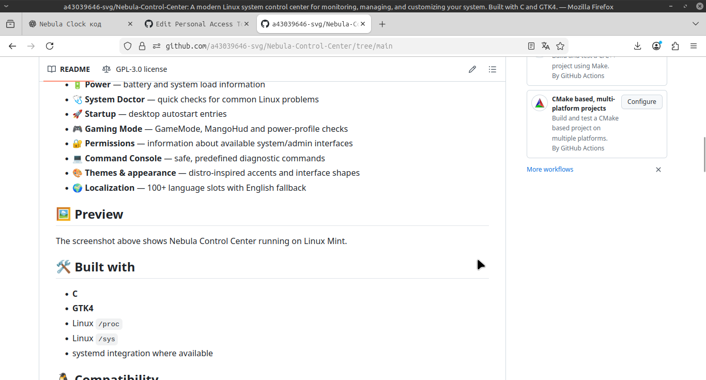

# 🌌 Nebula Control Center

A modern native Linux system control center built with **C + GTK4**.

Nebula Control Center brings system monitoring, diagnostics, and useful Linux controls together in one desktop application.



## ✨ Features

- 🖥️ **Overview** — CPU, memory, GPU, storage, uptime, network and power
- ⚙️ **Processes** — inspect running processes and resource usage
- 🧩 **Hardware** — CPU, GPU, kernel, temperatures and system information
- 🔧 **Services** — systemd service information
- 💾 **Storage** — mounted filesystems and disk usage
- 🌐 **Network** — interfaces, addresses and traffic counters
- 🔋 **Power** — battery and system load information
- 🩺 **System Doctor** — quick checks for common Linux problems
- 🚀 **Startup** — desktop autostart entries
- 🎮 **Gaming Mode** — GameMode, MangoHud and power-profile checks
- 🔐 **Permissions** — information about available system/admin interfaces
- 💻 **Command Console** — safe, predefined diagnostic commands
- 🎨 **Themes & appearance** — distro-inspired accents and interface shapes
- 🌍 **Localization** — 100+ language slots with English fallback

## 🖼️ Preview

The screenshot above shows Nebula Control Center running on Linux Mint.

## 🛠️ Built with

- **C**
- **GTK4**
- Linux `/proc`
- Linux `/sys`
- systemd integration where available

## 🐧 Compatibility

Nebula Control Center is primarily developed and tested on **Linux Mint** and Debian/Ubuntu-based systems.

Other Linux distributions may work when the required GTK4 libraries and system utilities are available.

## 📦 Build from source

### Debian / Ubuntu / Linux Mint

Install dependencies:

```bash
sudo apt install build-essential pkg-config libgtk-4-dev pciutils
```

Build:

```bash
make
```

Run:

```bash
./nebula-control-center
```

Install system-wide:

```bash
sudo make install
```

## 🌍 Localization

Translations are stored separately in:

```text
locales/
```

Nebula Control Center includes **100+ language slots**. Missing translations fall back to English.

Adding a translation does not require changing the C source code.

## 🎨 Appearance

Available accent themes include:

- Nebula
- Linux Mint
- Ubuntu
- Arch
- Fedora
- Debian
- Manjaro
- openSUSE
- Pop!_OS
- elementary
- Zorin
- Kali
- Ocean
- Rose
- Amber

Interface shapes:

- Rounded
- Soft
- Square

## 📁 Project structure

```text
src/
├── main.c
├── system_info.c
├── system_info.h
├── process_manager.c
├── process_manager.h
├── storage.c
├── storage.h
├── network.c
├── network.h
├── services.c
├── services.h
├── i18n.c
└── i18n.h

locales/
└── *.lang

icons/
└── Nebula Control Center icons
```

## 🚫 Plugins

The experimental plugin system was removed.

Nebula Control Center **does not load or execute third-party plugins**.

This keeps the application simpler and avoids introducing an extension API before a proper security model is defined.

## 🚧 Project status

**Current version: v2.1.1**

Nebula Control Center is a **public preview** and is under active development.

Expect some distribution-specific differences, incomplete translations, and changes between releases.

Bug reports, testing results, translation improvements, and feature suggestions are welcome.

## 🤝 Contributing

You can help by:

- testing on different Linux distributions;
- reporting bugs;
- improving translations;
- improving documentation;
- contributing code.

For larger changes, open an issue first so the idea can be discussed.

## 📜 License

See [`LICENSE`](LICENSE).

## 🌌 Nebula Project

Nebula Project creates open-source software, tools, and experiments.

**Built to explore.**
